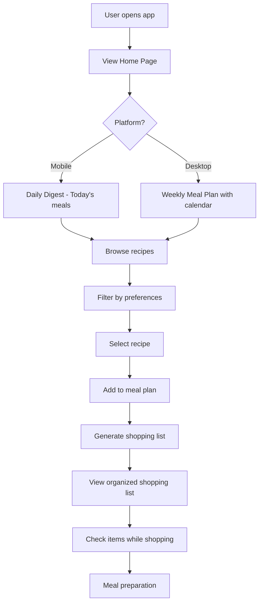
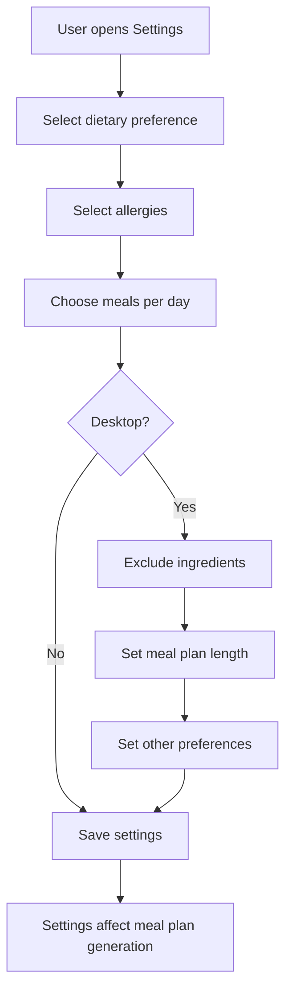

# PROJECT_BRIEF.md

## Executive Summary

- **Project Name**: MealPlanner (MealPrep)
- **Vision**: Help users plan their meals efficiently by providing an intuitive platform to discover recipes, organize meal plans, and generate shopping lists.
- **Mission**: Build a meal planning application that enables users to customize their dietary preferences, discover recipes, plan weekly meals, and automatically generate shopping lists to simplify meal preparation.

### Full Description

MealPlanner is a meal planning application designed to help users organize their meals efficiently. The application allows users to discover recipes filtered by dietary preferences, plan meals for the week, manage shopping lists, and customize settings according to their dietary needs and restrictions. The application provides both mobile and desktop experiences, with responsive design patterns optimized for each platform.

## Context

### Core Domain

The application operates in the meal planning and recipe management domain. Users can:

- Discover recipes based on dietary preferences (vegetarian, vegan, keto, etc.), meal types (breakfast, lunch, dinner), and filters (quick & easy, gluten-free, etc.)
- Plan meals for daily or weekly schedules
- Generate and manage shopping lists automatically from planned meals
- Customize dietary preferences, allergies, and meal planning parameters

### Ubiquitous Language

| Term           | Definition                                                                     | Synonyms        |
| -------------- | ------------------------------------------------------------------------------ | -------------- |
| Meal Plan      | A schedule of planned meals (breakfast, lunch, dinner) for a specific period    | Meal Schedule  |
| Recipe         | A detailed set of instructions and ingredients for preparing a dish             | Dish           |
| Daily Digest   | Mobile view showing today's planned meals with quick actions                   | Today's Meals  |
| Weekly Meal Plan | Desktop view showing planned meals for the current week with calendar        | Week View      |
| Shopping List  | List of ingredients organized by category, generated from planned meals        | Grocery List   |
| Dietary Preference | User-selected dietary style (omnivore, vegetarian, vegan, keto, etc.)      | Diet Type      |
| Swap Meal      | Action to replace a planned meal with another suggestion                      | Replace Meal   |
| Meal Card      | UI component displaying meal image, name, and action buttons                  | Meal Item      |

## Features & Use-cases

The main use-cases and features of the project:

- **Home Page**: View daily (mobile) or weekly (desktop) meal plans with quick actions
- **Recipe Discovery**: Search and filter recipes by dietary preferences, meal type, and other criteria
- **Shopping List**: View, manage, and print shopping lists organized by category (Produce, Dairy, Meat, Pantry)
- **Settings**: Customize dietary preferences, allergies, number of meals per day, ingredient exclusions, and meal plan length

## User Journey maps

### Meal Planner User

- **Role**: Person seeking to organize meals and simplify grocery shopping
- **Goals**: Plan meals efficiently, discover recipes matching dietary needs, generate shopping lists automatically
- **Actions**: Browse recipes, select meals, customize preferences, manage shopping lists

#### Main Journey: Weekly Meal Planning

#### Settings Customization Journey

