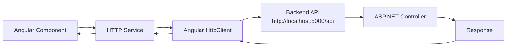

# Architecture

## Language/Framework

### Frontend

- **Framework**: Angular 20 → @frontend/package.json
- **UI Library**: Tailwind CSS 3.4 - Custom design system with orange theme (#FF8C00, #FFD700)
- **Routing**: Angular Router - Standalone components with `@frontend/src/app/app.routes.ts`
- **Data Fetching**: HTTP Client (to be implemented) - Angular HttpClient for API calls
- **Form Handling**: Angular Reactive Forms - `@angular/forms` package available
- **Validation**: Angular validators - Built-in form validation
- **State Management**: Component-level state - No global state management yet
- **Build Tool**: Angular CLI - `@angular/cli` via npm scripts
- **Structure**: Standalone components - Feature-based structure in `@frontend/src/app/`

### Backend

- **Language/Framework**: ASP.NET Core 8 → @backend/backend.csproj
- **API Style**: REST - Controller-based API with `@backend/Controllers/`
- **Architecture**: Controller-based - Controllers handle HTTP requests
- **ORM**: Entity Framework Core 8 - Npgsql.EntityFrameworkCore.PostgreSQL 8.0.0
- **Schema path**: EF Core migrations (to be created) - Migrations folder when DbContext is set up
- **Endpoints**: `@backend/Controllers/` - HealthController available at `/api/health`
- **Database**: PostgreSQL 16 - Connection via Docker Compose (@docker-compose.yml)
- **Caching**: Not configured yet
- **Testing**: xUnit - Test project at @backend.Tests/

#### Database

- **Type**: PostgreSQL 16
- **ORM/Driver**: Entity Framework Core with Npgsql
- **Connection**: Connection string in @backend/appsettings.Development.json - Host=localhost, Port=5432, Database=mealplanner_dev
- **Migration**: EF Core Migrations - `dotnet ef migrations` (to be configured when DbContext created)
- **Seeding**: Not configured yet
- **Mock**: Testcontainers.PostgreSql 3.10.0 - For integration tests

## Full project structure

```
kata-meal-planner/
├── frontend/           # Angular 20 frontend
│   ├── src/
│   │   ├── app/        # Standalone components
│   │   └── environments/  # Environment config
│   └── package.json
├── backend/            # ASP.NET Core 8 API
│   ├── Controllers/     # API endpoints
│   ├── Program.cs       # Startup configuration
│   └── backend.csproj
├── backend.Tests/       # xUnit test project
├── docker-compose.yml   # PostgreSQL container
└── docs/               # Documentation
```

### Naming Conventions

- **Files**: kebab-case for Angular (e.g., `app.component.ts`), PascalCase for C# (e.g., `HealthController.cs`)
- **Components**: PascalCase - Angular standalone components
- **Functions**: camelCase for TypeScript, PascalCase for C# methods
- **Variables**: camelCase for TypeScript, camelCase for C# (private fields use `_camelCase`)
- **Constants**: UPPER_SNAKE_CASE
- **Types/Interfaces**: PascalCase for both TypeScript and C#

## Services communication

### Frontend to Backend API Communication



### External Services

None configured yet.
