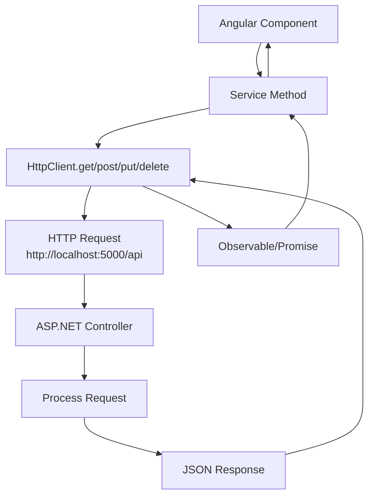

# Communication between backend and frontend

## Overview

When frontend component communicates with the backend, it typically does so through a series of services and API endpoints. This section outlines the key components involved in this communication process.

- **Services**: HTTP services to be created - Angular services using HttpClient for API calls
- **Request Types**: GET, POST, PUT, DELETE - Standard REST operations
- **Entities**: TypeScript interfaces/models to be created in `@frontend/src/app/models/` or similar
- **Data Flow**: Angular Component → HTTP Service → HttpClient → Backend API → Controller → Response
- **Error Handling**: To be implemented - HTTP interceptor for error handling
- **Validation**: Angular form validation on frontend, model validation on backend

### Data Flow

When a frontend component needs to communicate with the backend:

### API Configuration

- **Base URL**: Configured in @frontend/src/environments/environment.ts - `apiUrl: 'http://localhost:5000/api'`
- **CORS**: Configured in backend @backend/Program.cs - Allows requests from `http://localhost:4200`
- **Reference**: See @docs/memory-bank/backend/API_DOCS.md for available endpoints
