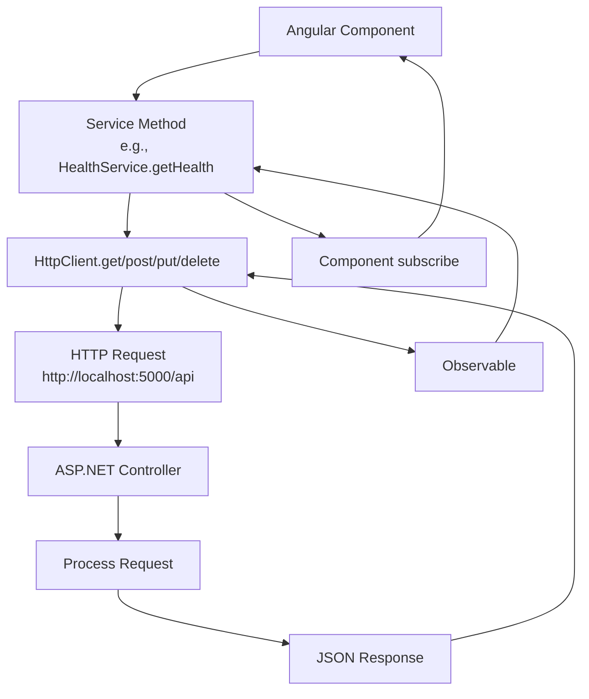

# Communication between backend and frontend

## Overview

When frontend component communicates with the backend, it typically does so through a series of services and API endpoints. This section outlines the key components involved in this communication process.

- **Services**: Angular services using HttpClient - Services in `@frontend/src/app/services/` (e.g., HealthService)
- **Request Types**: GET, POST, PUT, DELETE - Standard REST operations
- **Entities**: TypeScript interfaces/models in `@frontend/src/app/models/` (e.g., HealthStatus)
- **Data Flow**: Angular Component → HTTP Service → HttpClient → Backend API → Controller → Response
- **Error Handling**: Component-level error handling with subscribe error callbacks - HTTP interceptor to be added
- **Validation**: Angular form validation on frontend, model validation on backend

### Data Flow

When a frontend component needs to communicate with the backend:

### Example: Health Service

- **Service**: `HealthService` in @frontend/src/app/services/health.service.ts
- **Model**: `HealthStatus` interface in @frontend/src/app/models/health.model.ts
- **Usage**: Component injects `HealthService`, calls `getHealth()`, subscribes to Observable
- **Error Handling**: Component handles errors in subscribe error callback

### API Configuration

- **Base URL**: Configured in @frontend/src/environments/environment.ts - `apiUrl: 'http://localhost:5000/api'`
- **CORS**: Configured in backend @backend/Program.cs - Allows requests from `http://localhost:4200`
- **Reference**: See @docs/memory-bank/backend/API_DOCS.md for available endpoints
