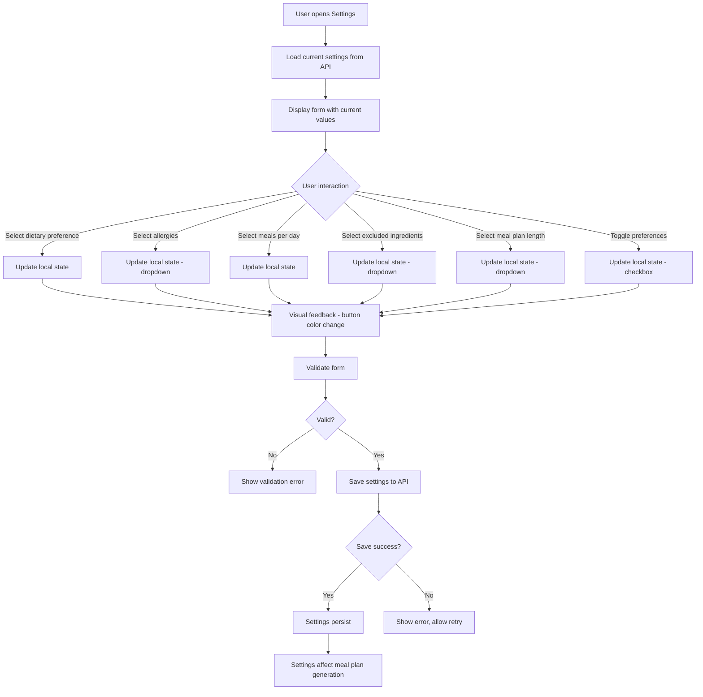

# Forms

This part describe how frontend forms are handled in the project, including libraries used, validation strategies, and state management.

## State Management

- Form state managed locally with immediate visual feedback
- Settings persist across sessions (saved to backend/state management)
- Optimistic updates for immediate user feedback
- Form state tracks:
  - Dietary preference selection (single selection)
  - Allergies (multiple selection)
  - Number of meals per day (single selection: 2, 3, or 4)
  - Excluded ingredients (desktop only, multiple selection)
  - Meal plan length (desktop only, single selection)
  - Other preferences checkboxes (desktop only: leftovers, auto grocery list)

## Validation

- **Client-side validation**: 
  - At least one dietary preference must be selected (required validation)
  - Form validation prevents submission if no dietary preference selected
  - Visual feedback for validation errors
  
- **Validation rules**:
  - Dietary preferences: Required, at least one selection
  - Allergies: Optional, multiple selections allowed
  - Meals per day: Required, single selection (2, 3, or 4)
  - Excluded ingredients: Optional (desktop only)
  - Meal plan length: Required with default "1 Week" (desktop only)
  - Other preferences: Optional checkboxes (desktop only)

## Error handling

- **Error display**: Show error message if save fails, allow retry
- **Network errors**: Graceful degradation with error message and retry option
- **Invalid data**: Handle invalid API responses gracefully
- **Form reset**: Ability to reset form to default values

## Form Flow

Settings form flow from user interaction to backend communication:

