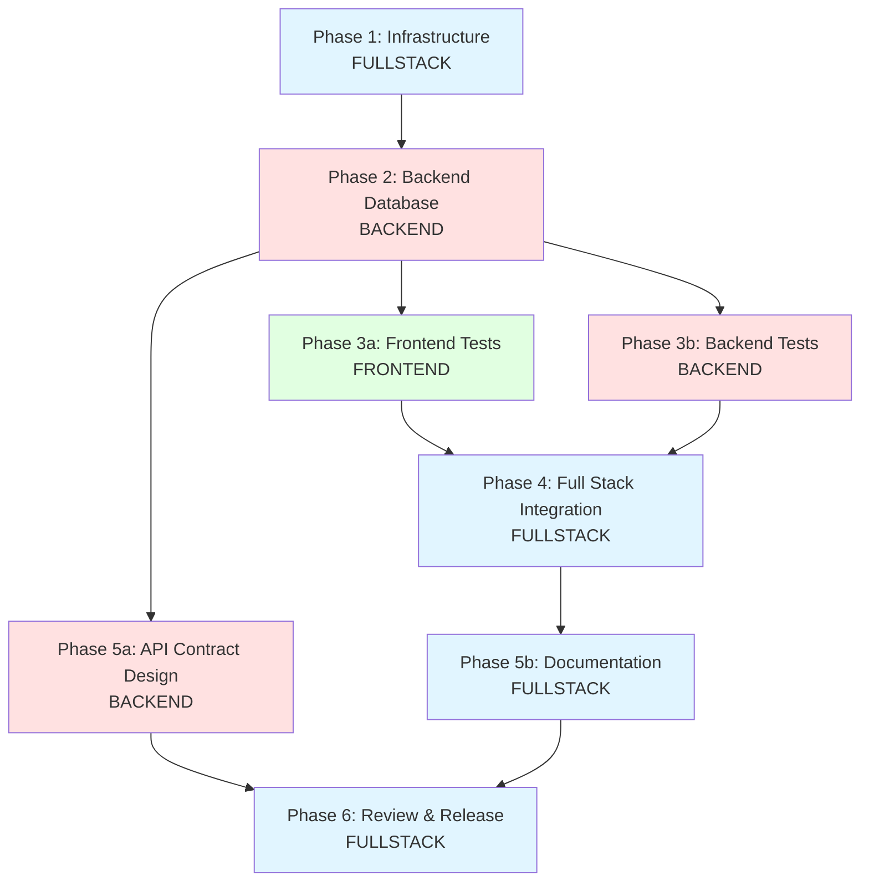

# Tactical Work Graph: Project Setup Remaining Tasks

## Summary

**Remaining work**: ~8-10 hours  
**Critical path**: Database → Backend DbContext → Integration Tests → Full Stack Verification  
**Max parallelization**: 3 agents (Frontend, Backend, Fullstack)

## Task Analysis

### Completed ✅

- Frontend project setup (Angular 20 + Tailwind CSS)
- Backend project setup (ASP.NET Core 8 + packages)
- Basic configuration files
- Health endpoint created
- CORS configured

### Remaining Tasks by Category

#### Phase 1: Infrastructure (30min) - **FULLSTACK**

1. Verify Docker Desktop running
2. Verify Docker Compose available
3. Check port conflicts (4200, 5000, 5432)
4. Start PostgreSQL container
5. Verify container health

#### Phase 2: Backend Database (1h) - **BACKEND**

1. Design database schema approach (EF Core migrations strategy)
2. Set up DbContext (empty structure, ready for migrations)

#### Phase 3: Testing Infrastructure (2-3h) - **PARALLEL**

- **Frontend Tests** (1h) - **FRONTEND**
  1. Create basic Playwright test structure (`e2e/` directory)
  2. Write E2E test: Frontend loads and displays basic content
  3. Verify Playwright test runner works

- **Backend Tests** (1h) - **BACKEND**
  1. Create basic xUnit test structure in `backend.Tests`
  2. Write unit test: Backend health endpoint returns 200 OK
  3. Create basic Testcontainers integration test example
  4. Write integration test: Backend connects to PostgreSQL via Testcontainers

#### Phase 4: Full Stack Integration (1h) - **FULLSTACK**

1. Write E2E test: Frontend can call backend health endpoint
2. Verify full stack integration (frontend calls backend API)
3. Run all verification steps from SETUP_GUIDE.md

#### Phase 5: Design & Documentation (1h) - **BACKEND + FULLSTACK**

- **Backend** (30min)
  1. Design API contract structure (REST endpoints)

- **Fullstack** (30min)
  1. Document any deviations from SETUP_GUIDE.md
  2. Update README.md with setup instructions if needed

#### Phase 6: Review & Release (1h) - **FULLSTACK**

1. Code review: Frontend structure follows Angular 20 best practices
2. Code review: Backend structure follows ASP.NET Core 8 conventions
3. Review: Environment configuration matches SETUP_GUIDE.md
4. Review: All acceptance criteria met
5. Functional review: Full stack runs locally without errors
6. Verify all verification steps from SETUP_GUIDE.md pass
7. Tag commit as "initial-setup" if required

## Dependency Graph



**Legend:**

- 🔵 **FULLSTACK** - Integration, infrastructure, cross-cutting concerns
- 🔴 **BACKEND** - Backend-specific tasks (.NET, database, API)
- 🟢 **FRONTEND** - Frontend-specific tasks (Angular, Playwright)

## Parallelization Opportunities

### Level 1: Parallel (no dependencies)

- **Phase 3a (Frontend Tests)** ↔ **Phase 3b (Backend Tests)** - Can run simultaneously
- **Phase 5a (API Design)** can start after Phase 2 (independent of tests)

### Level 2: Sequential Dependencies

- **Phase 1** → **Phase 2** (Database container must exist before DbContext)
- **Phase 2** → **Phase 3** (DbContext needed for backend integration tests)
- **Phase 3** → **Phase 4** (Tests must exist before full stack integration)
- **Phase 4** → **Phase 5b** (Integration verified before documentation)
- **Phase 5** → **Phase 6** (Design and docs complete before review)

## Role Assignments

### 🔵 FULLSTACK Agent

**Responsibilities:**

- Infrastructure verification (Docker, ports)
- Database container startup and verification
- Full stack integration testing
- Cross-cutting documentation
- Final review and release

**Tasks:**

- [ ] Phase 1: Infrastructure (30min)
- [ ] Phase 4: Full Stack Integration (1h)
- [ ] Phase 5b: Documentation (30min)
- [ ] Phase 6: Review & Release (1h)

**Total: ~3 hours**

### 🔴 BACKEND Agent

**Responsibilities:**

- Database schema design
- DbContext implementation
- Backend test structure and unit/integration tests
- API contract design

**Tasks:**

- [ ] Phase 2: Backend Database (1h)
- [ ] Phase 3b: Backend Tests (1h)
- [ ] Phase 5a: API Contract Design (30min)

**Total: ~2.5 hours**

### 🟢 FRONTEND Agent

**Responsibilities:**

- Frontend test structure
- Playwright E2E tests
- Frontend unit tests

**Tasks:**

- [ ] Phase 3a: Frontend Tests (1h)

**Total: ~1 hour**

## Critical Path Timeline

```
Hour 0-0.5:  FULLSTACK → Phase 1 (Infrastructure)
              ↓
Hour 0.5-1.5: BACKEND → Phase 2 (Database)
              ↓
Hour 1.5-2.5: BACKEND → Phase 3b (Backend Tests)
              ↓
Hour 1.5-2.5: FRONTEND → Phase 3a (Frontend Tests) [PARALLEL]
              ↓
Hour 2.5-3.5: FULLSTACK → Phase 4 (Full Stack Integration)
              ↓
Hour 3.5-4:   BACKEND → Phase 5a (API Design) [PARALLEL]
Hour 3.5-4:   FULLSTACK → Phase 5b (Documentation) [PARALLEL]
              ↓
Hour 4-5:     FULLSTACK → Phase 6 (Review & Release)
```

**Total critical path**: ~5 hours  
**With parallelization**: ~3-4 hours (depending on agent availability)

## Coordination Points

1. **After Phase 1**: FULLSTACK confirms Docker container is running → BACKEND can proceed
2. **After Phase 2**: BACKEND confirms DbContext ready → FRONTEND and BACKEND can start tests
3. **After Phase 3**: Both agents confirm tests working → FULLSTACK can integrate
4. **After Phase 4**: FULLSTACK confirms integration → proceed to documentation/review

## Acceptance Criteria Checklist

### Infrastructure ✅→

- [ ] Docker Desktop running verified
- [ ] Docker Compose available verified
- [ ] Ports 4200, 5000, 5432 available
- [ ] PostgreSQL container started and healthy
- [ ] Database connection verified from backend

### Backend Database ✅→

- [ ] Database schema approach designed
- [ ] DbContext set up (empty, ready for migrations)
- [ ] Database connection working

### Testing ✅→

- [ ] Playwright test structure created (`e2e/` directory)
- [ ] Frontend unit tests run successfully
- [ ] xUnit test structure created in `backend.Tests`
- [ ] Backend unit test: Health endpoint returns 200 OK
- [ ] Testcontainers integration test example created
- [ ] Integration test: Backend connects to PostgreSQL

### Full Stack ✅→

- [ ] E2E test: Frontend loads and displays content
- [ ] E2E test: Frontend can call backend health endpoint
- [ ] Full stack integration verified manually

### Design & Documentation ✅→

- [ ] API contract structure designed
- [ ] Deviations from SETUP_GUIDE.md documented
- [ ] README.md updated if needed

### Review & Release ✅→

- [ ] Code review: Frontend structure
- [ ] Code review: Backend structure
- [ ] Environment configuration reviewed
- [ ] All acceptance criteria met
- [ ] Functional review: Full stack runs locally
- [ ] All verification steps from SETUP_GUIDE.md pass
- [ ] Commit tagged as "initial-setup" if required

## Risk Mitigation

- **Risk**: Docker container fails to start  
  **Mitigation**: FULLSTACK verifies Docker Desktop first, checks logs if container fails

- **Risk**: DbContext conflicts with existing code  
  **Mitigation**: BACKEND reviews existing backend structure before implementing

- **Risk**: Testcontainers timeout  
  **Mitigation**: BACKEND ensures Docker has sufficient resources before running integration tests

- **Risk**: Frontend-backend integration fails  
  **Mitigation**: FULLSTACK verifies CORS configuration and API URL matches before integration tests

---

**Status**: Ready for parallel execution with three agents (Frontend, Backend, Fullstack)
